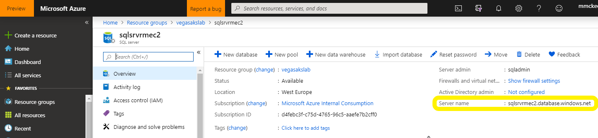
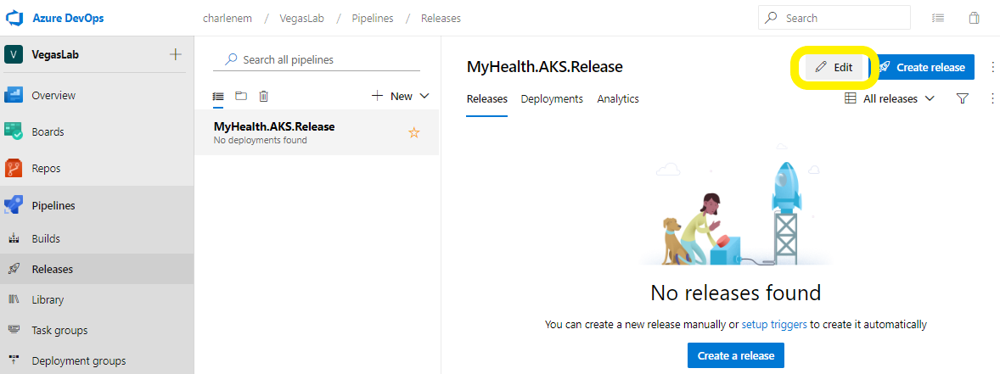
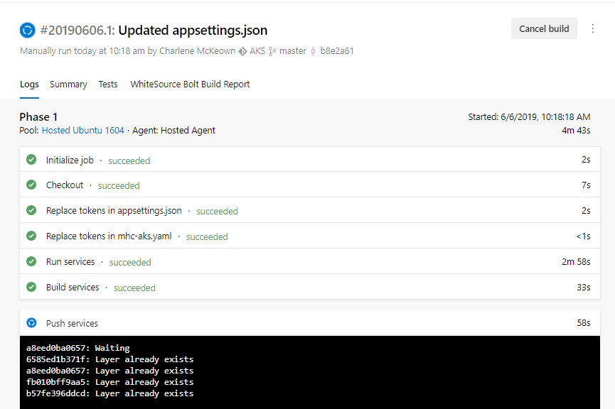
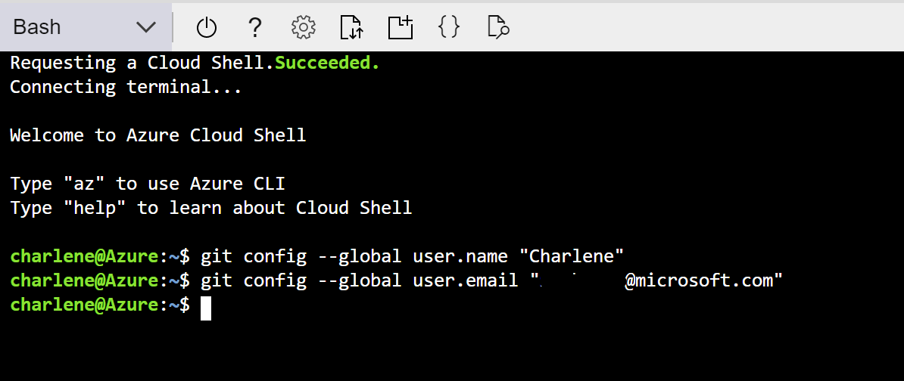

# This lab is going through a complete re-write as of April 2019. Use at your peril :)

# Get Ready for DevOps and Containers

An introduction to the principles of DevOps and containerisation using Azure DevOps and Azure Kubernetes Service. This lab borrows heavily from the excellent [Azure DevOps Hands on Labs website](https://www.azuredevopslabs.com/labs/vstsextend/kubernetes/), but adds in a bit more detail on some steps for users new to Cloud or Azure.

## What is Kubernetes and the Azure Kubernetes Service?

While containerising applications can provide great performance, immutability and other benefits, it can also introduce a new problem: management. Imagine a football team without a manager or a game plan - you may have players in the wrong positions, players pushing forward when they should be pulling back; a coordination nightmare. Well, when your application is broken up into containerised parts, the same can happen - it can be difficult to tell the application parts what to do as a collective without issuing commands to each of the individual components, making upgrading applications, performing health-checks etc. a bit of a nightmare.

This is where Kubernetes comes in. Kubernetes, at its basic level, is an open-source system that was initially developed by Google for running and coordinating containerised applications across a cluster of machines. It is a platform designed to completely manage the lifecycle of containerised applications using methods that provide predictability, scalability, and high availability. In short, it makes managing multiple containers much easier, and it's what we'll be using to run and manage our app.


> To understand a bit more about Kubernetes, we really recommend [this video](https://www.youtube.com/watch?v=4ht22ReBjno) - it's an illustrated guide to Kubernetes and does an amazing job of distilling some advanced concepts into a short video guide.

Here is a very basic glossary of some key Kubernetes terms/concepts you'll come across in the lab, but don't worry about understanding them too much in detail at this stage as that's out of scope of this lab.

1. **Node** — These are virtual machines (servers) that perform the requested or assigned tasks and host the containers.
2. **Cluster** - A collection of nodes that Kubernetes uses to spread containers across, meaning that if one node goes down, an application can still stay up and running using containers that have been copied to another healthy node.
3. **Pod** — A group of one or more containers deployed to a single node (physical machine/server). All containers in a pod share basic networking resources (IP address etc.). This ensures you can move containers around to different nodes in the cluster more easily.
4. **Service** — Think of this as the gateway to your application for the outside world. When you create a Kubernetes service, it will take incoming requests (for example visitors to your website) and direct them to the pods containing your application — no matter where they've moved to in the cluster.
5. **Container Registry** - while not a specific Kubernetes term, this is a key concept for working with containers in general. A container registry is essentially a repository for your application images, and is what Docker/Kubernetes pull from to create a container that runs your application. We will be using Azure Container Registry to host our app images, and then we'll be pointing Azure DevOps towards it to pull our application images from for deployment.

The Azure Kubernetes Service, which we'll call AKS for short, is pretty much what it sounds like - it is a deployment of Kubernetes that is hosted in Azure as a first party service, which features lots of other clever bells and whistles over a standard local Kubernetes deployment that make running clusters easier for customers. We'll avoid going into too much detail here for now.

## What is Azure DevOps?

Azure DevOps provides developer services to help teams plan their work, collaborate on code, build, test and deploy applications using these rich services.


This consists of the following services:

1. Azure Repos - Git or TFVC repositories for source control of your code
2. Azure Pipelines - Build and release management to support continuous integration and delivery of your apps
3. Azure Boards - Agile tools to support planning and tracking your work, code defects, and issues using Kanban and Scrum methods
4. Azure Test Plans - A variety of tools to test your apps, including manual/exploratory testing, load testing, and continuous testing
5. Azure Artifacts - Share packages from public and private sources and integrate into CI/CD pipelines
6. Highly customisable dashboards for sharing progress and trends
7. Built-in wiki for sharing information with your team
8. In addition, the Azure DevOps ecosystem provides support for adding extensions, integrating with other popular services, such as: Campfire, Slack, Trello, UserVoice, and more, and developing your own custom extensions

So in summary it's a one-stop shop that makes implementing DevOps processes much easier for developers, but also allows them to plug in any other preferred third-party tools and services they may already be using in place of the included tools if they so wish.

## In this lab, you will:

1. Create a Kubernetes cluster in Azure using the Azure Kubernetes Service (AKS)
2. Create a project in Azure DevOps
3. Set up a Continuous Integration and Continuous Delivery pipeline in Azure DevOps to deploy a demo website to AKS
4. Pull the demo website code locally and make some changes
5. Use your new pipeline to push these changes directly to your demo website in AKS and view the results

Once we're done, you'll end up with an architecture looking similar to this (except **you're** the engineer!):


You can view an interactive version of this [here](https://azure.microsoft.com/en-in/solutions/architecture/cicd-for-containers/) with descriptions of each step.

## Create a Resource Group

Resource groups in Azure can be thought of as logical buckets in which to house your resources.  A resource group itself must be given a region when it is created, however, the resources within it can be located in different regions. You cannot create an Azure resource without specifying which resource group to put it in.

We will be using the Azure CLI and Azure Cloud Shell throughout this lab to create and manage our resources.  Azure Cloud Shell is an interactive, browser-accessible shell which provides the flexibility of choosing the shell experience that best suits the way you work. If it is the first time that you request cloudshell, you'll need to create a storage account and mount a fileshare storage, in this case you can click 'Create storage'. To know more about Azure Cloud Shell please refer to [Overview of Azure Cloud Shell](https://docs.microsoft.com/en-gb/azure/cloud-shell/overview).

1. Navigate to the Azure Portal and click on the Cloud Shell icon (>_ on the top right panel of the portal) and select 'Bash (Linux)'


2. Create a resource group and specify your preferred region.  Some examples are eastus, westeurope, westus. 

``` bash
	az group create --name vegasakslab --location <region>
```

## Deploy Azure Kubernetes Service

The Kubernetes community releases minor versions every 3 months or so, which bring new features and improvements to the software.  By default, when you deploy an AKS cluster, the version is always n-1 (where n is the current minor version released upstream).  We will get the latest version we can deploy for a given region.  Type the below, replacing 'region' with your preferred region.

``` bash
	version=$(az aks get-versions -l <region> --query 'orchestrators[-1].orchestratorVersion' -o tsv)
```

To create your cluster, copy and paste the below into your cloud shell, again replacing 'region' with your preferred region, and a unique name for your AKS cluster.

> NOTE: AKS cluster names must contain only letters, numbers and hyphens, and be between 3 and 31 characters long.

``` bash
	 az aks create --resource-group vegasakslab --name <unique-aks-cluster-name> --enable-addons monitoring --kubernetes-version $version --generate-ssh-keys --location <region>
```
The AKS cluster will take a little while to deploy.  In the mean time, we can go ahead and create the rest of our resources.

## Deploy Azure Container Registry (ACR)

As mentioned in the glossary, we can use ACR to securely host our application images. Copy and paste the below, replacing 'region' with your preferred region, and giving your ACR a unique name **between 5 and 50 characters, letters and numbers only**

``` bash
	az acr create --resource-group vegasakslab --name <unique-acr-name> --sku Standard --location <region>
```
When you created the AKS cluster, a Service Principal was automatically generated.  We need this to authorize the AKS cluster to connect to our Container Registry and pull down container images.

A Service Principal allows you to delegate only the necessary permissions to an application, so you have the flexibility to restrict and revoke permissions whenever you need to and keep your subscription secure. In our scenario, we will need to access a container registry - both to push and pull images to get our website running on a Kubernetes cluster.  The steps below show you how to get the ID of the Service Principal for AKS and the resource id of our container registry.  With these, we can create a role assignment for the service principal, **acrpull**, which allows for pulling of images by the service principal. 

Make sure you replace $AKS_CLUSTER_NAME with whatever your named your AKS cluster.  Similarly, replace $ACR_NAME with whatever you named your ACR.

``` bash
 	# Get the id of the service principal configured for AKS
 	CLIENT_ID=$(az aks show --resource-group vegasakslab --name $AKS_CLUSTER_NAME --query "servicePrincipalProfile.clientId" --output tsv)

 	# Get the ACR registry resource id
 	ACR_ID=$(az acr show --name $ACR_NAME --resource-group vegasakslab --query "id" --output tsv)

	# Create role assignment
	az role assignment create --assignee $CLIENT_ID --role acrpull --scope $ACR_ID
```

## Deploy an Azure SQL Database

We need to deploy a database for the back end of our application.  Azure SQL Database is a general purpose relational database managed service.  There are a number of deployment options, and for this lab, we will deploy a single database managed via a SQL DB Server.  Replace 'region' with your chosen region and give your SQL Server a unique name.  Change the password below to something unique and secure, and make a note of it - you will need it later.

> NOTE: SQL Server names must be lowercase and unique. 

``` bash
	az sql server create -l <region> -g vegasakslab -n <unique-sqlserver-name> -u sqladmin -p P2ssw0rd1234
```
Once that is successful (it may take a few minutes), create the database, making sure to use the server name you chose above, and keep the database name **mhcdb**. 

``` bash
	 az sql db create -g vegasakslab -s <unique-sqlserver-name> -n mhcdb --service-objective S0
```

Go the resource group 'vegasakslab'. Verify that you see the resources below (with whatever you named them). 


We need to make a note of some of the resource names.  We will use these when creating our CI/CD pipeline in Azure DevOps.  Make sure you note down:

* Your AKS cluster name

* Your Container registry Login server name


* Your SQL Server name




## Create an Azure DevOps account and generate a demo project

Now we will generate our demo project, using Azure DevOps Generator!

Go to [Azure DevOps Generator!](https://azuredevopsdemogenerator.azurewebsites.net) (right-click and open in a new tab) and sign in with your Azure DevOps account.  If you don't have one, click 'Get started for free' and follow the instructions.


Choose a unique name for your Azure DevOps account, and choose a location to host it.


You're all setup with an Azure DevOps account now!  Go back to the demo generator and sign in.  Accept the terms and conditions and proceed to choosing a project.  Select your account name, and choose the project specified in the image below (click the DevOps Labs and then the AKS project)  Give it a unique name.


You will be prompted to download a Kubernetes Azure DevOps extension followed by Replace Tokens from the Visual Studio Marketplace.  Click on 'Kubernetes' to proceed to the marketplace page, and click the green button 'Get it free'. Afterwards, do the same for 'Replace Tokens'.


Install the extension on your Azure DevOps account.  Once installed, return to the demo generator and create your project.  To know more about [how to install free extensions for Azure DevOps!] here(https://docs.microsoft.com/en-us/azure/devops/marketplace/install-vsts-extension?view=vsts)

> NOTE: Make sure to click the blue install button, rather than the grey download button for Team Foundation Server / Azure DevOps Server.  These are on-premise versions of the Azure DevOps, which we won't be using.


You may have to reselect the project template to refresh the status of your Kubernetes extension installation.


After a minute or two, your project will be successfully created.  Navigate to your project - it's time to start building our build and release pipeline!


##  Explore repository

Now, we will explore our project code.  Select Repos and then Files on the left hand side menu:


Our repository contains the code for a .NET Core MVC (Model View Controller) website (in folder 'src').  We have some other files in this, and in the root of our project, that enable us to deploy the website to containers:


**dockerfile** - This file enables Docker to build an image automatically by reading the instructions contained within.  In this case we will be pulling the aspnetcore:1.0 image from the Microsoft Docker hub.

**docker-compose.yml** - This file defines the image that will be used and points to the Dockerfile above which we used to build the image for us.

**mhc-aks.yaml** - This is our Kubernetes manifest file.  In here, we define the deployments, services and pods that we need for our application to run.


## Build Definition

Now we can edit our build to correctly build our Docker image.  Select our build definition 'MyHealth.AKS.build' and click the edit button.


You will see two 'Replace Tokens' tasks and four Docker Compose tasks.  The replace tokens task is a neat little feature that will replace some of the hard coded values in our code sitting in source control.  This is especially valuable when deploying the same code to different environments, which will have different databases, container registries, AKS clusters etc. 

1. Select 'Variables' from the bar at the top, and then update each of the variables below to match the values you made a note of earlier:

- ACR Name
- SQLpassword
- SQLserver
- SQLuser


You will need to repeat the next step for each Docker build task highlighted below:


2. Under 'Azure Subscription' select the your subscription.  The first time you do this, you will need to Authorize the service connection (this step allows you to deploy from Azure DevOps into your Azure subscription).

1. Under Azure Container Registry, select the container registry you created earlier.


Repeat for Build, Push and Lock tasks.  Save the build, but do not queue anything just yet.

## Release Definition

Navigate to Releases on the left hand menu, click the ellipsis next to MyHealth.AKS.Release and click 'Edit':



You will see our release pipeline.  Once a new build is ready, we have a release ready to deploy automatically.  The first thing we need to do is update some of our variables.  Click 'Variables' just above your pipeline.


Update each of the variables below to match the values you made a note of earlier:

- ACR Name
- SQLpassword
- SQLserver
- SQLuser

Now that our variables are referencing our Azure resources, we can edit the Release tasks.  Click the Tasks menu item (it should have a red exclamation mark beside it) and click 'Dev'.

In the 'Execute Azure SQL: DacpacTask', update the Azure Subscription to the one you authorized earlier.


 Under the AKS Deployment phase, click the first task.  Scroll down to 'Secrets':

 Again, choose your Azure subscription from the drop down box.  Next, choose your Container Registry from the drop down box.  A secret called mysecretkey is created in AKS cluster through Azure DevOps by using a command 'kubectl create secret' in the background (we will use more kubectl later in the lab). This secret will be used for authorization while pulling myhealth.web image from the Azure Container Registry.


  We can now move on to the second task in our AKS deployment phase.  Simply repeat the steps above and save your release.


## Kick off our build and release pipeline

We are ready to deploy!

Go back to the build definition you edited earlier.  Click on the ellipsis and select 'Queue new build':


Accept the defaults and queue it:


You can view progress by clicking on it:




You can view detailed logs by clicking on any of the steps in the process.  The build should succeed - if so, a release will automatically be kicked off as we have enabled continuous delivery.  Let's check it out.

Navigate to Release and select the new release. 


You may have to wait for a minute or so before it appears.  You'll see something like the below when you click on it.


Here we can see that the our successful build has triggered a new release into our Dev environment.  Under the Dev environment, click 'In progress' to see detailed logs of what's happening.

After a few minutes, the release should be successful.  If you get any errors regarding your container registry in the AKS deployment phase, go back to your release definition and confirm that your Azure subscription and container registry are selected - then save the definition and repeat the steps above.

## View your newly deployed website

Now - Azure DevOps has deployed the website to a Kubernetes cluster - but how can we see it?


1. Go back to the Azure Portal and open Cloud Shell once again.  We need to tell the Shell which Kubernetes cluster we want to work with, and we do this by getting the context:

``` bash
az aks get-credentials -g vegasakslab -n <AKS cluster name>
```
You should see a message like the below:


 kubectl is a command line tool for working with our Kubernetes service.  Now, let's check if our Pods are up and running.  If so, we should see both the front and back end Pods up and running:

``` bash
kubectl get pods
```


Now we need to find out the public IP that the website is deployed to.  Kubernetes supports exposing our application via two methods: Load Balancer and NodePorts.  In this exercise, we can look at our mhc-aks.yaml file to confirm that we are using the Load Balancer service in Kubernetes to expose our application front end to a public IP:


To find out what public IP address has been assigned, we can type the following into our command prompt window:

``` bash
kubectl get service mhc-front
```


Copy and paste the external IP into a browser window.  You should see your newly deployed Health Clinic application.


## Explore your Kubernetes dashboard

To view our Kubernetes dashboard, we need to ensure that the Service Account we created earlier has the appropriate permissions.

``` bash
kubectl create clusterrolebinding kubernetes-dashboard -n kube-system --clusterrole=cluster-admin --serviceaccount=kube-system:kubernetes-dashboard
```

The following command will allow us to view the Kubernetes dashboard. 

``` bash
az aks browse -g vegasakslab --name yourAKSname
```


Your dashboard should open in a new browser window automatically, and you will see something like the below.  


This is where you monitor your application's health, from viewing logs to viewing dashboards on services, pods and other elements of your Kubernetes deployment. If everything's green, then all is good!

## Set up Continuous Integration

Now for our final step, we want to complete the DevOps pipeline that we've set up. Right now, we have successfully set up 'Continuous Deployment', which essentially means when we trigger a Build, like we did in a previous step, the application's code is bundled up, then sent over to the Azure Kubernetes Service, and deployed into the wild, all without us having to perform any steps manually.

But what if we want all of this to happen as soon as we make a change to the application's code? Well, this is what we call Continuous Integration. This is what enables developers to publish changes to application code much more quickly, and respond to their user's needs in a much more agile way.

Let's set this up. Firstly, go back to Azure DevOps and open up the **Build and Release** page, then click your build and navigate to the **Triggers** tab.


We want to check the box that says **Enable continuous integration**. Then click 'Save'.


This will now trigger our Build automatically when a change has been made to the application's code on the *master* branch.

> Branches allow developers to work on a new feature in a separate branch from the main code, then re-introduce their code when it's ready, by performing something called a *merge*. We'll just be using the master branch in this lab for simplicity.

Let's test if this works. Head over to the Code page which should open your code files. On the top right, you'll see an option called 'Clone' - give it a click and copy the Clone URL to your clipboard.


Think of this as a direct link to your code, which we'll use to download it to your machine. We could make quick changes to the code in Azure DevOps itself like we did before; however to simulate how developer's typically work with code locally then push up to a remote master, we'll download it to our machine to work on it. Copying code in this way is called a `Git Clone` operation.

## needs updated to use Cloud Shell

With the link in your clipboard, let's open up Git Bash on your machine (you can find a shortcut on your desktop).

> Git is a command line tool that is widely used by developers to track code changes and collaborate across various people and teams on a single source code. Imagine the complexity of working on 20 Word documents seperately and then trying to merge them together - this is what Git helps us with in the code world!

First, we need to tell Git who we are so that it can track our changes. Enter the following in the terminal, replacing NAME and EMAIL with a nickname and the email you used when creating your Azure DevOps account:

```
git config --global user.name "NAME"
git config --global user.email "EMAIL"
```



Now we'll use Git to grab the code from our remote repository in Azure DevOps. Type the following, replacing LINK with the Clone link you copied from Azure DevOps. The first command will navigate us to our desktop which is where the code will be saved.

```
cd desktop
git clone LINK
```


Great, now if you look at your desktop a folder called 'AKS' should have appeared. This contains all of the websites code and is identical to the code in our Azure DevOps repo. Now let's edit it.

Open up Visual Studio Code (a link is on your desktop) - this is a free open source code editor (properly called an Integrated Development Environment, or IDE) made by Microsoft and perfect for working with code of any type.

Once it's launched (accept any first run messages that come up), click **Open folder...** and select the 'AKS' folder on your desktop. This should open up our code base to work with.


Now, in the Explorer pane on the left, navigate into the folder containing our website's Home page by following this path: `src > MyHealth.Web > Views > Home` then opening `Index.cshtml`.


This is a C# HTML page and essentially renders the structure and content of our medical website's homepage. Let's make a little change to the page just so we can see our changes automatically being pulled through to our live website running on Azure Kubernetes. Change any of the page text (careful not to change anything inside a html tag - < > ), for example I've modified 'Connect with your health' to 'I've just changed this page'. Then hit 'Save' (or `Ctrl + S`).


Now that we've modified the code, we need to tell Git that we'd like to commit the change and then send it up to the remote Azure DevOps repository to be merged into the master branch.

We can do this directly in VS Code. Click on the Source Control icon on the left panel, and you'll see the change you've made as a tracked change. All we need to do is enter a message for the commit (think of this as a comment summarising our commit for future reference) - something like: 'Changed home page' or 'modified homepage text'.

Then click the tick icon or press `Ctrl + Enter` to perform the Commit. Accept any messages that come up about automatic staging of changes.


This has now updated our **local** master branch with the changes we made, but we haven't yet told Azure DevOps about this. Git keeps a local record of all your code changes / commits, and another on the server (Azure DevOps), so we need to now synchronise the two.

Click the elipses (...) in the top right corner of the Source Control panel, then hit 'Sync'. Accept any message that comes up.


Now Git will first pull down any changes that have been made remotely since we copied it to our machine, it will check if there are any conflicts, and if not (and there shouldn't be since no-one else is using our repo!) it will then merge and push the code back up to Azure DevOps.

Let's double check that this has happened. Go back to Azure DevOps in your web browser and refresh the Code page. You should see your commit message has appeared next to the 'src' folder (since this contains the homepage code you changed).


That's not all. Because we set up the Continuous Integration trigger, we should now no longer have to manually click 'Queue new Build' to push code to our live website. Let's confirm this by heading to the 'Build and Release' page.

You should see that a new Build is already in progress, along with the latest commit message we pushed.


If all goes well, the build should then initiate a Release like before, thanks to our Continuous Deployment pipeline, which will make its way to your Azure Kubernetes Service and out on the wild web. Nice one!

## So what have I just achieved?

Congratulations on completing the lab, we hope you found it useful and engaging. To summarise, you have:

1. Created a Kubernetes cluster in Azure and a project in Azure DevOps to host and run your code
2. Set up a Continuous Delivery pipeline in Azre DevOps & linked to your Azure environment (no small feat!)
3. Tested the pipeline and monitored your application running in the Kubernetes service
4. Set up a Continuous Integration pipeline to feed new code changes straight through to the CD pipeline
5. Used Git and VS Code to Clone the code repository to your machine, then edited the code and pushed it back to Azure DevOps
6. Automatically triggered a new build through CI which has pushed your changes straight to your live website

DevOps is by no means simple, but you've covered a lot of ground and tackled the core principals of CI, CD and working with code. Well done.

## Where do I go from here?

Now that you've completed the lab, we hope you'll want to take what you've done and continue to learn and develop in Azure. You can get a free Azure subscription as a sandbox environment to play around with for your personal use, which you can get from [Visual Studio Dev Essentials](https://visualstudio.microsoft.com/dev-essentials/).

Happy coding!
