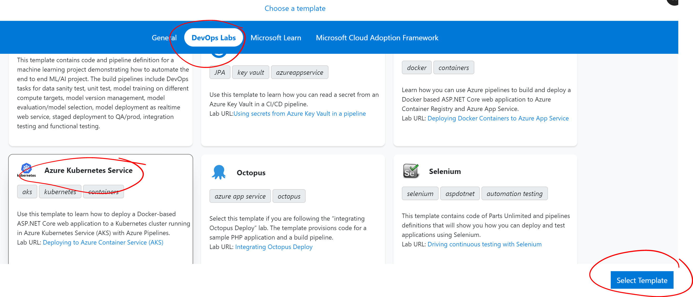

# Get Ready for DevOps and Containers

An introduction to the principles of DevOps and containerisation using Visual Studio Team Services (VSTS) and Azure Container Service (AKS).  This lab borrows heavily from the excellent [Visual Studio Hands on Labs website](https://almvm.azurewebsites.net/labs/vstsextend/kubernetes/) but adds in a bit more detail on some steps that users new to Cloud or Azure might find confusing.

## What is Kubernetes?

## What is VSTS?

## In this lab, you will:

1. Create a Kubernetes cluster in Azure
2. Create a project in VSTS
3. Set up a CI/CD pipeline to deploy a demo website to Kubernetes Service

## Prerequisites

* An Azure subscription. You can get one free through [Visual Studio Dev Essentials](https://visualstudio.microsoft.com/dev-essentials/).

## Start your lab environment

Navigate to the link provided to you and click 'provision lab'

## Log into the Azure Portal and connect to your lab workstation


1. Sign into the [Microsoft Azure portal](https://portal.azure.com).  Use the details provided to you when you provisioned your lab in the first step.

1. Locate your workstation - you should see it listed as in the screenshot below.  Click it and you should be taken to the overview page for the virtual machine.


1. Click Connect.  To the right, you should be prompted to download an RDP file.  Go ahead and download this, and double click it once it downloads.


1. Connect to the virtual machine using the username and password provided to you when you provisioned the lab.


1. You should now be able to access your virtual machine!  Next, we will deploy some Azure resources.

## Create a Service Principal and a pair of SSH RSA keys

<Description of a SP, why we need it>

1. Navigate to the Azure Portal you just logged into.
1. Click on the 'Cloud Shell' icon and select 'Bash (Linux)'


1. If prompted to create a storage account, click yes.
1. Once your Bash shell has loaded, type the following, replacing surname with your own.  Service Principals must have unique names.

``` bash
	az ad sp create-for-rbac --name acr-service-principal-surname --role contributor --query password --output tsv
```
1. Make a note of the password, you will need it in the next shortly.
1. Next, type the following into the same Bash shell, again replacing surname with your own:
``` bash
	az ad sp show --id http://acr-service-principal-surname --query appId --output tsv
```
1. Make a note of the appID, you will need it shortly and later on in the lab.

Next, we'll generate our ssh keys. Open Git-Bash and type the following:

``` bash
	ssh-keygen -t rsa
```

You will be prompted for a file path and a password.  Simply press enter three times to leave both values blank.  


The default filepath should be:

``` bash
/home/odl_user/.ssh/id_rsa
```

We need to output the contents of our public key, contained in id_rsa.pub.  To do this, type:

``` bash
	cat .ssh/id_rsa.pub
```

Copy everything to a notebad (it starts with ssh-rsa followed by a long string of characters) - you will need this in the next step.


## Deploy Kubernetes Service and supporting services

1. On your virtual machine, log into the [Microsoft Azure portal](https://portal.azure.com) again using the step above.
1. Click the 'Deploy to Azure' button below to deploy the necessary resources into your Azure subscription.

<a href="https://portal.azure.com/#create/Microsoft.Template/uri/https%3A%2F%2Fraw.githubusercontent.com%2FCharleneMcKeown%2FDevOps-and-Containers%2Fmaster%2Fazuredeploy.json">  </a>


-Subscription: Leave as default (it should auto populate with your lab subscription)
-Resource Group: Create a new resource group and give it a name
-Location: East US
-Acr Name: Choose a unique, lowercase name
-DB Server Name: Choose a unique, lowercase name
-AKS Name: AKS
-DNS Prefix: demoaks
-SSH RSA Public Key - Enter the public key you just saved to your notepad
-Service Principal Client - Enter the appId generated earlier
-Service Principal Client Secret - Enter the password generated earlier


Check in on the status of your resource deployment by clicking on the notification icon:


Once your resources are deployed, we need to make a note of some of the resource names.  We will use these when creating our CI/CD pipeline in VSTS.

## Create a VSTS account and generate a demo project

Now we will generate our demo project, using [VSTS Generator!](https://vstsdemogenerator.azurewebsites.net).

> [!NOTE]
> Please use Chrome when accessing the demo generator.


Please select sign up for a new account if you are taking part in this lab at Ready.  You should have some details pre-populated at this stage:


Leave these unchanged and proceed to sign up.  On the next page, click 'Create new account'.  Choose a unique name for your account, leave other settings unchanged (we want to use Git) and hit continue:


You're all setup with a VSTS account now!  Go back to the demo generator and sign in.  Accept the terms and conditions and proceed to choosing a project.  Select your account name, and choose the project specified below.  Give it a unique name.



You will be prompted to download a Kubernetes VSTS extension from the Visual Studio Marketplace.  Click on 'Kubernetes' to proceed to the marketplace page, and click the green button 'Get it free'. 


Install the extension on your VSTS account.  Once installed, return to the demo generator and create your project.  


You may have to reselect the project template to refresh the status of your Kubernetes extension installation.


After a minute or two, your project will be successfully created.  Navigate to your project - it's time to start building our build and release pipeline!


To be done:


##  Explore repository

Once you're on your project overview page, I recommend you switch over to the new navigation layout.  To do this, click your profile on the top right hand side, and select 'Preview Features'.  


Set everything to on:


Now, we will explore our project code.  Select Code and then Files on the left hand side menu:


Our repository contains the code for a .NET Core MVC (Model View Controller) website.  We have some other files in this project that enable us to deploy the website to containers:


dockerfile - This file enables Docker to build an image automatically by reading the instructions contained within. 

docker-compose.yml - This file defines the image that will be used and points to the Dockerfile above which we used to build the image for us.

mhc-aks.yaml - This is our Kubernetes manifest file.  In here, we define the deployments, services and pods that we need for our application to run. 


Now, we need to change the code in two files to make sure we deploy our application correctly.  


1. Select mhc-aks.yml from the list of files in your repository.  You will see the option to edit the file as below:


Scroll down to line 93 and replace YOUR_ACR with the name you gave your Container Registry earlier.  Once you have made the change, hit the commit button to save your change.

1. appsettings.json

Navigate to appsettings.json in /src/MyHealth.Web/ and select the appsettings.json file.  Edit line 9 to reflect the name of your own SQL Server you created earlier.


Commit your changes and proceed to the next step.

## Build Definition

Now we can edit our build to correctly build our Docker image.  Select our build definition 'MyHealth.AKS.build' and click the edit button. 


You will see four Docker Compose tasks.  You will need to repeat the next step for each build task highlighted below:


1. Under 'AzureSubscription' select the default subscription.  It should be called something like AzureHOL.  The first time you do this, you will need to Authorize the service connection (this step allows you to deploy from VSTS into your Azure subscription).

1. Under Azure Container Registry, select the container registry you created earlier.


Repeat for Build, Push and Lock tasks.  Save the build, but do not queue anything just yet.

## Release Definition

Navigate to Releases on the left hand menu, click the elipses next to MyHealth.AKS.Release and click 'Edit':


You will see our release pipeline.  Once a new build is ready, we have a release ready to deploy automatically.  The first thing we need to do is update some of our variables.  Click 'Variables' just above your pipeline.


1. Replace YOUR_ACR with the name of the container registry you created earlier.
1. Replace YOUR_DBSERVER with the name of the SQL server you created earlier.

Now that our variables are referencing our Azure resources, we can edit the Release tasks.  Click the Tasks menu item (it should have a red exclamation mark beside it).

In the 'Execute Azure SQL: DacpacTask', update the Azure Subscription to the one you authorized earlier.


 Switch to 'Preview version' of Kubernetes task


## dd


