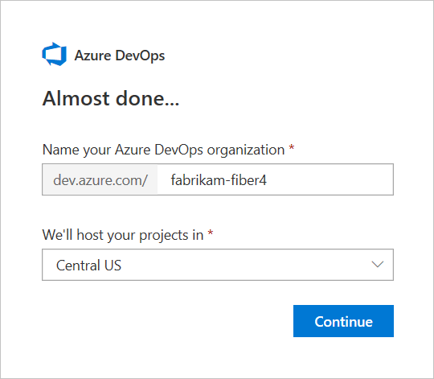
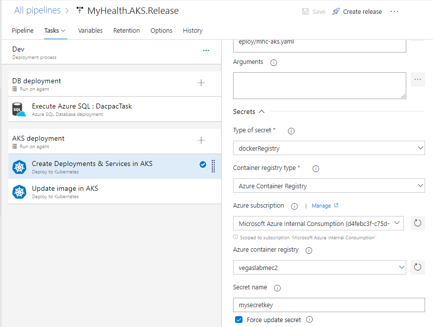
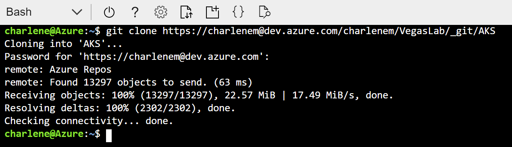
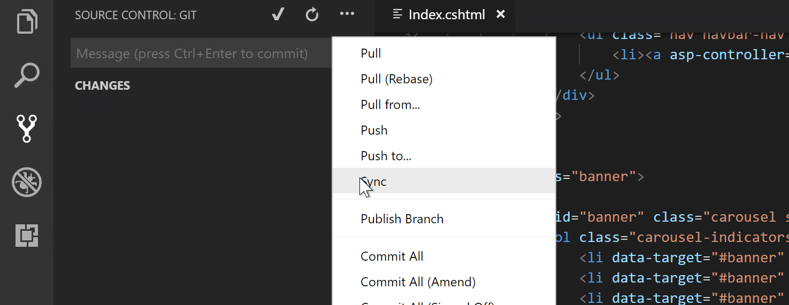

# Get Ready for DevOps and Containers yeah!

An introduction to the principles of DevOps and containerisation using Azure DevOps (previously VSTS) and the Azure Kubernetes Service. This lab borrows heavily from the excellent [Azure DevOps Hands on Labs website](https://almvm.azurewebsites.net/labs/vstsextend/kubernetes/), but adds in a bit more detail on some steps for users new to Cloud or Azure.

## Challenge me!

If you're comfortable with building pipelines in Azure DevOps and have worked with containers before, you might want to skip down to [Hard Mode](#hard-mode)

## What is Kubernetes and the Azure Kubernetes Service?

While containerising applications can provide great performance, immutability and other benefits, it can also introduce a new problem: management. Imagine a football team without a manager or a game plan - you may have players in the wrong positions, players pushing forward when they should be pulling back; a coordination nightmare. Well, when your applcation is broken up into containerised parts, the same can happen - it can be difficult to tell the application parts what to do as a collective without issuing commands to each of the individual components, making upgrading applications, performing health-checks etc. a bit of a nightmare.

This is where Kubernetes comes in. Kubernetes, at its basic level, is an open-source system that was initially developed by Google for running and coordinating containerised applications across a cluster of machines. It is a platform designed to completely manage the lifecycle of containerised applications using methods that provide predictability, scalability, and high availability. In short, it makes managing multiple containers much easier, and it's what we'll be using to run and manage our app.


> To understand a bit more about Kubernetes, we really recommend [this video](https://www.youtube.com/watch?v=4ht22ReBjno) - it's an illustrated guide to Kubernetes and does an amazing job of distilling some advanced concepts into a short video guide.

Here's a very basic glossary of some key Kubernetes terms/concepts you'll come across in the lab, but don't worry about understanding them too much in detail at this stage as that's out of scope of this lab.

1. **Node** — These are physical machines (servers) that perform the requested or assigned tasks and host the containers. 
1. **Cluster** - A collection of nodes that Kubernetes uses to spread containers across, meaning that if one node goes down, an application can still stay up and running using containers that have been copied to another healthy node.
1. **Pod** — A group of one or more containers deployed to a single node (physical machine/server). All containers in a pod share basic networking resources (IP address etc.). This ensures you can move containers around to different nodes in the cluster more easily.
1. **Service** — Think of this as the gateway to your application for the outside world. When you create a Kubernetes service, it will take incoming requests (for example visitors to your website) and direct them to the pods containing your application — no matter where they've moved to in the cluster.
1. **Container Registry** - while not a specific Kubernetes term, this is a key concept for working with containers in general. A container registry is essentially a repository for your application images, and is what Docker/Kubernetes pull from to create a container that runs your application. We will be using Azure Container Registry to host our app images, and then we'll be pointing Azure DevOps towards it to pull our application images from for deployment.

The Azure Kubernetes Service, which we'll call AKS for short, is pretty much what it sounds like - it is a deployment of Kubernetes that's hosted in Azure as a first party service, which features lots of other clever bells and whistles over a standard local Kubernetes deployment that make running clusters easier for customers. We'll avoid going into too much detail here for now.

## What is Azure DevOps?

Azure DevOps (previously Visual Studio Team Services / VSTS) is Microsoft's answer to DevOps, and is essentially a cloud service for collaborating on code development, from writing the first lines of code through to building it, testing it and deploying it to production. 


This consists of the following components:

1. Git repositories for source control of your code 
1. Build and release management to support continuous integration and delivery of your apps 
1. Agile tools to support planning and tracking your work, code defects, and issues using Kanban and Scrum methods 
1. A variety of tools to test your apps, including manual/exploratory testing, load testing, and continuous testing 
1. Highly customisable dashboards for sharing progress and trends 
1. Built-in wiki for sharing information with your team 
1. In addition, the Azure DevOps ecosystem provides support for adding extensions, integrating with other popular services, such as: Campfire, Slack, Trello, UserVoice, and more, and developing your own custom extensions

So in summary it's a one-stop shop that makes implementing DevOps processes much easier for customers, but also allows them to plug in any other preferred third-party tools and services they may already be using in place of the included tools if they so wish.

> Please note: some screenshots in this lab were taken when Azure DevOps was still labelled as VSTS

## In this lab, you will:

1. Create a Kubernetes cluster in Azure using the Azure Kubernetes Service (AKS)
1. Create a project in Azure DevOps
1. Set up a Continuous Integration and Continuous Delivery pipeline in Azure DevOps to deploy a demo website to AKS
1. Pull the demo website code locally and make some changes
1. Use your new pipeline to push these changes directly to your demo website in AKS and view the results

Once we're done, you'll end up with an architecture looking similar to this (except **you're** the engineer!):


You can view an interactive version of this [here](https://azure.microsoft.com/en-in/solutions/architecture/cicd-for-containers/) with descriptions of each step.

> **Important!** If you have already created your AKS cluster in preparation for this lab, please skip to [Deploy Kubernetes Service and supporting services](https://github.com/CharleneMcKeown/DevOps-and-Containers#deploy-kubernetes-service-and-supporting-services).

## Create a Service Principal and a pair of SSH RSA keys

When an application needs access to deploy or configure resources through Azure Resource Manager, you create a service principal, which is a credential for your application. Unlike just giving your application your own Azure log in credentials, a Service Principal allows you to delegate only the necessary permissions to that application, so you have the flexibility to restrict and revoke permissions whenever you need to and keep your subscription secure. In our scenario, we will need to access a container registry - both to push and pull images to get our website running on a Kubernetes cluster.  The steps below show you how to create one.

1. Navigate to the Azure Portal and click on the 'Cloud Shell' icon (on the top right panel of the portal) and select 'Bash (Linux)'


3. If prompted to create a storage account, click yes.
4. Once your Bash shell has loaded, type the following, replacing surname with your own.  Service Principals must have unique names.
> Note: if you're copying and pasting, to paste into Cloud Shell on Windows you must use the keyboard shortcut `Shift + Insert` instead of the normal `Ctrl + V`

``` bash
	az ad sp create-for-rbac --name acr-service-principal-surname --role contributor --query password --output tsv
```

5. Make a note of the password, you will need it shortly.
6. Next, type the following into the same Bash shell, again replacing surname with your own:

``` bash
	az ad sp show --id http://acr-service-principal-surname --query appId --output tsv
```

7. Make a note of the appID, you will need it shortly and later on in the lab.

Next, we'll generate our SSH keys. Type the following into your Bash shell:

``` bash
	ssh-keygen -t rsa
```

8. You will be prompted for a file path and a password.  Simply press enter three times to leave both values blank.  


The default filepath should be:

``` bash
/home/odl_user/.ssh/id_rsa
```

9. We need to output the contents of our public key, contained in id_rsa.pub.  To do this, type:

``` bash
	cat .ssh/id_rsa.pub
```

10. Copy everything to a notepad (it starts with ssh-rsa followed by a long string of characters) - you will need this in the next step.


We have just copied all the details we'll need to access our Azure resources using the Service Principal we created. This will be how we let our application deployment pipeline access Azure in a secure way further on in the lab, so keep these details safe for now.

## Deploy Kubernetes Service and supporting services

> **Important!** If you already deployed an AKS cluster, all you need to do is create an Azure SQL DB and an Azure Container Registry. You can do this manually, or take advantage of the one click deployment (<a href="https://portal.azure.com/#create/Microsoft.Template/uri/https%3A%2F%2Fraw.githubusercontent.com%2FCharleneMcKeown%2FDevOps-and-Containers%2Fmaster%2Fsupportingservices.json">click here for it</a>) using the ARM template 'supportingservices.json' (located in the root of this repo). Once completed, skip to [Create an Azure DevOps account and generate a demo project](https://github.com/CharleneMcKeown/DevOps-and-Containers#create-an-azure-devops-account-and-generate-a-demo-project
).


1. Right-click the 'Deploy to Azure' button below and select **Open in new tab** to deploy the necessary resources into your Azure subscription.

<a href="https://portal.azure.com/#create/Microsoft.Template/uri/https%3A%2F%2Fraw.githubusercontent.com%2FCharleneMcKeown%2FDevOps-and-Containers%2Fmaster%2Fazuredeploy.json">  </a>


* **Subscription:** Leave as default (it should auto populate with your lab subscription)
* **Resource Group:** Create a new resource group and give it a name
* **Location:** East US
* **Acr Name:** Choose a unique, lowercase name
* **DB Server Name:** Choose a unique, lowercase name (name it something like labdbaksdev35) but change the number
* **AKS Name:** AKS
* **DNS Prefix:** Choose a unique, lowercase name
* **SSH RSA Public Key:** Enter the public key you just saved to your notepad (the key beginning with `ssh-rsa`)
* **Service Principal Client:** Enter the appId generated earlier
* **Service Principal Client Secret:** Enter the password generated earlier


Leave the rest of the values as their default, as shown in the screenshot above.

Tick 'Agree to terms and conditions' and 'Pin to dashboard' then click **Purchase**. You can check in on the status of your resource deployment either by watching the dashboard tile or by clicking on the notification icon:


Once your resources are deployed, we need to make a note of some of the resource names.  We will use these when creating our CI/CD pipeline in Azure DevOps.  Make sure you note down:

* Your Container registry name
* Your SQL Server name


## Create an Azure DevOps account and generate a demo project

Now we will generate our demo project, using Azure DevOps Generator! 

Go to [Azure DevOps Generator!](https://vstsdemogenerator.azurewebsites.net) (right-click and open in a new tab) and either sign in with your Azure subscription credentials or select sign up for a new account if you are taking part in this lab at Ready.

> NOTE: Please use Chrome when accessing the demo generator.


You should have some details pre-populated at this stage:


Leave these unchanged and proceed to sign up.  On the next page, click 'Create new account'.  Choose a unique name for your account, leave other settings unchanged (we want to use Git) and hit continue:



You're all setup with an Azure DevOps account now!  Go back to the demo generator and sign in.  Accept the terms and conditions and proceed to choosing a project.  Select your account name, and choose the project specified in the image below (click the DevOps Labs and then the AKS project)  Give it a unique name.


You will be prompted to download a Kubernetes Azure DevOps extension followed by Replace Tokens from the Visual Studio Marketplace.  Click on 'Kubernetes' to proceed to the marketplace page, and click the green button 'Get it free'. Afterwards, do the same for 'Replace Tokens'.


Install the extension on your Azure DevOps account.  Once installed, return to the demo generator and create your project.  


You may have to reselect the project template to refresh the status of your Kubernetes extension installation.


After a minute or two, your project will be successfully created.  Navigate to your project - it's time to start building our build and release pipeline!


##  Explore repository

Once you're on your project overview page, I recommend you switch over to the new navigation layout.  To do this, click your profile on the top right hand side, and select 'Preview Features'.  


Set everything to on:


Now, we will explore our project code.  Select Code and then Files on the left hand side menu:


Our repository contains the code for a .NET Core MVC (Model View Controller) website.  We have some other files in this project that enable us to deploy the website to containers:


**dockerfile** - This file enables Docker to build an image automatically by reading the instructions contained within.  In this case we will be pulling the aspnetcore:1.0 image from the Microsoft Docker hub.

**docker-compose.yml** - This file defines the image that will be used and points to the Dockerfile above which we used to build the image for us.

**mhc-aks.yaml** - This is our Kubernetes manifest file.  In here, we define the deployments, services and pods that we need for our application to run. 


Now, we need to change the code in two files to make sure we deploy our application correctly.  


1. Select mhc-aks.yml from the list of files in your repository.  You will see the option to edit the file as below:


Scroll down to line 93 and replace "\_\_ACR\_\_" with the name you gave your Container Registry earlier (eg. myacr2001.azurecr.io). Once you have made the change, hit the commit button, then Commit again in the menu that pops up to save your change.

2. appsettings.json

Navigate to appsettings.json in /src/MyHealth.Web/ and select the appsettings.json file.  Edit line 9 to reflect the name of your own SQL Server you created earlier.


You may also need to change the SQL DB user name and password in the same connection string. If you used the one-click deployment option, you can find the credentials for your SQL instance by viewing the supportingservices.json file. Hint: You can find the full connection string by navigating to the DB instance via the Azure Portal. However, do note the connection string excludes the credentials (i.e username and password).

Commit your changes and proceed to the next step.

## Build Definition

Now we can edit our build to correctly build our Docker image.  Select our build definition 'MyHealth.AKS.build' and click the edit button. 


You will see four Docker Compose tasks.  You will need to repeat the next step for each build task highlighted below:


1. Under 'AzureSubscription' select the your subscriptionL.  The first time you do this, you will need to Authorize the service connection (this step allows you to deploy from VSTS into your Azure subscription).

1. Under Azure Container Registry, select the container registry you created earlier.


Repeat for Build, Push and Lock tasks.  Save the build, but do not queue anything just yet.

## Release Definition

Navigate to Releases on the left hand menu, click the ellipsis next to MyHealth.AKS.Release and click 'Edit':


You will see our release pipeline.  Once a new build is ready, we have a release ready to deploy automatically.  The first thing we need to do is update some of our variables.  Click 'Variables' just above your pipeline.


1. Replace YOUR_ACR with the name of the container registry you created earlier.
1. Replace YOUR_DBSERVER with the name of the SQL server you created earlier.

Now that our variables are referencing our Azure resources, we can edit the Release tasks.  Click the Tasks menu item (it should have a red exclamation mark beside it) and click 'Dev'.

In the 'Execute Azure SQL: DacpacTask', update the Azure Subscription to the one you authorized earlier. <b>On this same task</b>, find the field <b>'DACPAC File'</b> and change the path from '$(System.DefaultWorkingDirectory)/AKS/deploy/myhealthclinic.dacpac' to <b>'$(System.DefaultWorkingDirectory)/MyHealth.AKS.build/deploy/myhealthclinic.dacpac'</b>.


 Under the AKS Deployment phase, click the first task.  Scroll down to 'Secrets':

 Again, choose your Azure subscription from the drop down box.  Next, choose your Container Registry from the drop down box.  You now need to grab the appID from your Service Principal that you created earlier.  Paste that into the 'Secret Name' text box.



 Scroll back up to the top, and change the version of the Task to 'Preview'.  Then choose your Azure subscription, the resource group you created earlier, and choose AKS for the Kubernetes Cluster:


  Scroll back down to 'Secrets' and make sure your Azure subscription and Container registry are still there (they should be, but you may have to select your Azure subscription again).

  We can now move on to the second task in our AKS deployment phase.  Simply repeat the steps above and save your release.


## Kick off our build and release pipeline

We are ready to deploy!  

Go back to the build definition you edited earlier.  Click on the ellipsis and select 'Queue new build':


Accept the defaults and queue it:


You can view progress by clicking on the build number:


You can view detailed logs by clicking on any of the steps in the process.  The build should succeed - if so, a release will automatically be kicked off as we have enabled continuous delivery.  Let's check it out.

Navigate to Release and select the new release. You may have to wait for a minute or so before it appears.  You'll see something like the below:


Here we can see that the our successful build has triggered a new release into our Dev environment.  Under the Dev environment, click 'In progress' to see detailed logs of what's happening.  

After a few minutes, the release should be successful.  If you get any errors regarding your container registry in the AKS deployment phase, go back to your release definition and confirm that your Azure subscription and container registry are selected - then save the definition and repeat the steps above.

## View your newly deployed website

Now - Azure DevOps has deployed the website to a Kubernetes cluster - but how can we see it? 

> Note: You will need Azure CLI and kubectl for this next step. [Install kubectl](https://kubernetes.io/docs/tasks/tools/install-kubectl/) and [install Azure CLI](https://docs.microsoft.com/en-us/cli/azure/install-azure-cli?view=azure-cli-latest).

1. Open a CMD prompt and type the following:

``` bash
az login
```
You will see a message similar to the below.  Follow the instructions to authenticate to the Azure resource manager.


1. Once you are successfully authenticated, type the following, replacing yourResourceGroup with the one you created earlier, and yourAKSname with AKS (or whatever you names your Kubernetes service)

``` bash
az aks get-credentials --resource-group yourResourceGroup --name yourAKSname
```

You should see a message like the below:


What we are doing here is making sure we are connecting to the correct Kubernetes service.  kubectl is a command line tool for working with our Kubernetes service.  Now, let's check if our Pods are up and running.  If so, we should see both the front and back end Pods up and running:

``` bash
kubectl get pods
```


Now we need to find out the public IP that the website is deployed to.  Kubernetes supports exposing our application via two methods: Load Balancer and NodePorts.  In this exercise, we can look at our mhc-aks.yaml file to confirm that we are using the Load Balancer service in Kubernetes to expose our application front end to a public IP:


To find out what public IP address has been assigned, we can type the following into our command prompt window:

``` bash
kubectl get service mhc-front
```


Copy and paste the external IP into a browser window.  You should see your newly deployed Health Clinic application.


## Explore your Kubernetes dashboard

We can explore our Kubernetes deployment via a handy dashboard by typing a single command.  Make sure you put your own resource group name and your AKS name below:

``` bash
az aks browse --resource-group yourResourceGroup --name yourAKSname
```

Your dashboard should open in a new browser window automatically, and you will see something like the below.  If it doesn't, open a new browser window and navigate to: http://127.0.0.1:8001/


This is where you monitor your application's health, from viewing logs to viewing dashboards on services, pods and other elements of your Kubernetes deployment. If everything's green, then all is good!

## Set up Continuous Integration

Now for our final step, we want to complete the DevOps pipeline that we've set up. Right now, we have successfully set up 'Continuous Deployment', which essentially means when we trigger a Build, like we did in a previous step, the application's code is bundled up, then sent over to the Azure Kubernetes Service, and deployed into the wild, all without us having to perform any steps manually.

But what if we want all of this to happen as soon as we make a change to the application's code? Well, this is what we call Continuous Integration. This is what enables Devs to publish changes to application's code much more quickly, and respond to their user's needs in a much more agile way.

Let's set this up. Firstly, go back to Azure DevOps and open up the **Build and Release** page, then click your build and navigate to the **Triggers** tab.


We want to check the box that says **Enable continuous integration**. Then click 'Save'.


This will now trigger our Build automatically when a change has been made to the application's code on the *master* branch. 

> Branches allow developers to work on a new feature in a separate branch from the main code, then re-introduce their code when it's ready, by performing something called a *merge*. We'll just be using the master branch in this lab for simplicity.

Let's test if this works. Head over to the Code page which should open your code files. On the top right, you'll see an option called 'Clone' - give it a click and copy the Clone URL to your clipboard.


Think of this as a direct link to your code, which we'll use to download it to your machine. We could make quick changes to the code in Azure DevOps itself like we did before; however to simulate how developer's typically work with code locally then push up to a remote master, we'll download it to our machine to work on it. Copying code in this way is called a `Git Clone` operation. 

With the link in your clipboard, let's open up Git Bash on your machine (you can find a shortcut on your desktop). 

> Git is a command line tool that is widely used by developers to track code changes and collaborate across various people and teams on a single source code. Imagine the complexity of working on 20 Word documents seperately and then trying to merge them together - this is what Git helps us with in the code world!

First, we need to tell Git who we are so that it can track our changes. Enter the following in the terminal, replacing NAME and EMAIL with a nickname and the email you used when creating your Azure DevOps account:

```
git config --global user.name "NAME"
git config --global user.email "EMAIL"
```


Now we'll use Git to grab the code from our remote repository in Azure DevOps. Type the following, replacing LINK with the Clone link you copied from Azure DevOps. The first command will navigate us to our desktop which is where the code will be saved.

```
cd desktop
git clone LINK
```



Great, now if you look at your desktop a folder called 'AKS' should have appeared. This contains all of the websites code and is identical to the code in our Azure DevOps repo. Now let's edit it.

Open up Visual Studio Code (a link is on your desktop) - this is a free open source code editor (properly called an Integrated Development Environment, or IDE) made by Microsoft and perfect for working with code of any type.

Once it's launched (accept any first run messages that come up), click **Open folder...** and select the 'AKS' folder on your desktop. This should open up our code base to work with.


Now, in the Explorer pane on the left, navigate into the folder containing our website's Home page by following this path: `src > MyHealth.Web > Views > Home` then opening `Index.cshtml`.


This is a C# HTML page and essentially renders the structure and content of our medical website's homepage. Let's make a little change to the page just so we can see our changes automatically being pulled through to our live website running on Azure Kubernetes. Change any of the page text (careful not to change anything inside a html tag - < > ), for example I've modified 'Connect with your health' to 'I've just changed this page'. Then hit 'Save' (or `Ctrl + S`).


Now that we've modified the code, we need to tell Git that we'd like to commit the change and then send it up to the remote Azure DevOps repository to be merged into the master branch.

We can do this directly in VS Code. Click on the Source Control icon on the left panel, and you'll see the change you've made as a tracked change. All we need to do is enter a message for the commit (think of this as a comment summarising our commit for future reference) - something like: 'Changed home page' or 'modified homepage text'.

Then click the tick icon or press `Ctrl + Enter` to perform the Commit. Accept any messages that come up about automatic staging of changes.


This has now updated our **local** master branch with the changes we made, but we haven't yet told Azure DevOps about this. Git keeps a local record of all your code changes / commits, and another on the server (Azure DevOps), so we need to now synchronise the two. 

Click the elipses (...) in the top right corner of the Source Control panel, then hit 'Sync'. Accept any message that comes up.



Now Git will first pull down any changes that have been made remotely since we copied it to our machine, it will check if there are any conflicts, and if not (and there shouldn't be since no-one else is using our repo!) it will then merge and push the code back up to Azure DevOps.

Let's double check that this has happened. Go back to Azure DevOps in your web browser and refresh the Code page. You should see your commit message has appeared next to the 'src' folder (since this contains the homepage code you changed).


That's not all. Because we set up the Continuous Integration trigger, we should now no longer have to manually click 'Queue new Build' to push code to our live website. Let's confirm this by heading to the 'Build and Release' page.

You should see that a new Build is already in progress, along with the latest commit message we pushed.


If all goes well, the build should then initiate a Release like before, thanks to our Continuous Deployment pipeline, which will make its way to your Azure Kubernetes Service and out on the wild web. Nice one!

## So what have I just achieved?

Congratulations on completing the lab, we hope you found it useful and engaging. To summarise, you have:

1. Created a Kubernetes cluster in Azure and a project in Azure DevOps to host and run your code
1. Set up a Continuous Delivery pipeline in Azre DevOps & linked to your Azure environment (no small feat!)
1. Tested the pipeline and monitored your application running in the Kubernetes service
1. Set up a Continuous Integration pipeline to feed new code changes straight through to the CD pipeline
1. Used Git and VS Code to Clone the code repository to your machine, then edited the code and pushed it back to Azure DevOps
1. Automatically triggered a new build through CI which has pushed your changes straight to your live website

DevOps is by no means simple, but you've covered a lot of ground and tackled the core principals of CI, CD and working with code. Well done.

## Where do I go from here?

Now that you've completed the lab, we hope you'll want to take what you've done and continue to learn and develop in Azure. You can get a free Azure subscription as a sandbox environment to play around with for your personal use, which you can get from [Visual Studio Dev Essentials](https://visualstudio.microsoft.com/dev-essentials/).

Happy coding!

# Hard Mode

You will be deploying a .NET MVC website to Azure Kubernetes Service. The website will have a SQL database. Your goal is to build a CI/CD pipeline that will push changes to the website source code to Azure DevOps repos, where continuous integration will kick off a build pipeline. That build pipeline will build your container image and push it to Azure Container Registry. Once it succeeds, a release pipeline will be automatically kicked off which will publish your SQL database dacpac (tables, stored procedures etc) to Azure SQL database, update AKS configurations and have AKS pull down the updated container image from ACR. 

Easy, right?!

1. Clone this repo - you will need the example project.
1. Create a 3-node Azure Kubernetes Service cluster.
1. Deploy an Azure Container Registry (ACR).
1. Create an Azure SQL Database.
1. Modify the Kubernetes manifest file to reflect your ACR (mhc-aks.yaml)
1. Modify appsettings.json to reflect your SQL DB.
1. Create a new Azure DevOps project and push your local repo to your new repo.
1. In Azure DevOps, create a build pipeline that will do the following:

	- perform Docker tasks to build your container image and push it to ACR
	- publish the myhealthclinic.dacpac file and Kubernetes manifest file as a build artifact

1. In Azure DevOps, create a release pipeline that will do the following:

	- publish the dacpac file to Azure SQL database
	- apply the configurations contained in your AKS manifest yaml file to your AKS cluster
	- update the container image in AKS by pulling from your ACR

1. Enable continuous integration and continuous deployment.
1. Connect to your AKS service, find out the public IP address for the website and verify it has deployed successfully.

