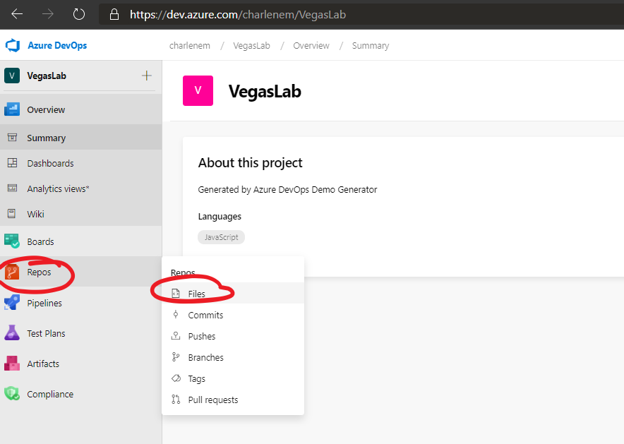
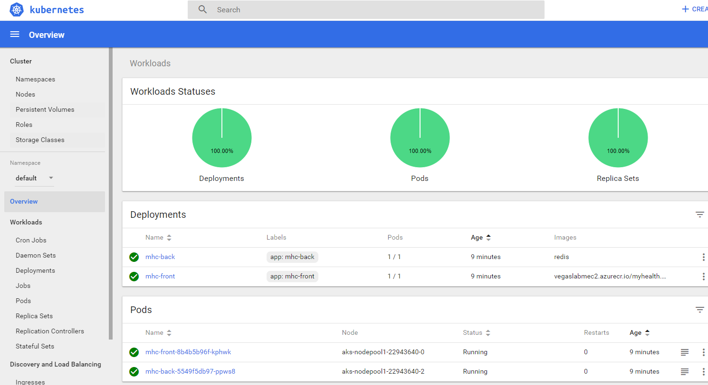

# Get Ready for DevOps and Containers

An introduction to the principles of DevOps and containerisation using Visual Studio Team Services (VSTS) and the Azure Kubernetes Service. This lab borrows heavily from the excellent [Visual Studio Hands on Labs website](https://almvm.azurewebsites.net/labs/vstsextend/kubernetes/), but adds in a bit more detail on some steps that users new to Cloud or Azure might find confusing.

## What is Kubernetes and the Azure Kubernetes Service?

While containerising applications can provide great performance, immutability and other benefits, it can also introduce a new problem: management. Imagine a football team without a manager or a game plan - you may have players in the wrong positions, players pushing forward when they should be pulling back; a coordination nightmare. Well, when your applcation is broken up into containerised parts, the same can happen - it can be difficult to tell the application parts what to do as a collective without issuing commands to each of the individual components, making upgrading applications, performing health-checks etc. a bit of a nightmare.

This is where Kubernetes comes in. Kubernetes, at its basic level, is an open-source system that was initially developed by Google for running and coordinating containerised applications across a cluster of machines. It is a platform designed to completely manage the lifecycle of containerised applications using methods that provide predictability, scalability, and high availability. In short, it makes managing multiple containers much easier, and it's what we'll be using to run and manage our app.


Here's a very basic glossary of some key Kubernetes terms/concepts you'll come across in the lab, but don't worry about understanding them too much in detail at this stage as that's out of scope of this lab.

1. **Node** — These are physical machines (servers) that perform the requested or assigned tasks and host the containers. 
1. **Cluster** - A collection of nodes that Kubernetes uses to spread containers across, meaning that if one node goes down, an application can still stay up and running using containers that have been copied to another healthy node.
1. **Pod** — A group of one or more containers deployed to a single node (physical machine/server). All containers in a pod share basic networking resources (IP address etc.). This ensures you can move containers around to different nodes in the cluster more easily.
1. **Service** — Think of this as the gateway to your application for the outside world. When you create a Kubernetes service, it will take incoming requests (for example visitors to your website) and direct them to the pods containing your application — no matter where they've moved to in the cluster.

The Azure Kubernetes Service, which we'll call AKS for short, is pretty much what it sounds like - it is a deployment of Kubernetes that's hosted in Azure as a first party service, which features lots of other clever bells and whistles over a standard local Kubernetes deployment that make running clusters easier for customers. We'll avoid going into too much detail here for now.

## What is VSTS?

Visual Studio Team Services (VSTS) is Microsoft's answer to DevOps, and is essentially a cloud service for collaborating on code development, from writing the first lines of code through to building it, testing it and deploying it to production. 


This consists of the following components:

1. Git repositories for source control of your code 
1. Build and release management to support continuous integration and delivery of your apps 
1. Agile tools to support planning and tracking your work, code defects, and issues using Kanban and Scrum methods 
1. A variety of tools to test your apps, including manual/exploratory testing, load testing, and continuous testing 
1. Highly customisable dashboards for sharing progress and trends 
1. Built-in wiki for sharing information with your team 
1. In addition, the VSTS ecosystem provides support for adding extensions, integrating with other popular services, such as: Campfire, Slack, Trello, UserVoice, and more, and developing your own custom extensions

So in summary it's a one-stop shop that makes implementing DevOps processes much easier for customers, but also allows them to plug in any other preferred third-party tools and services they may already be using in place of the included tools if they so wish.

## In this lab, you will:

1. Create a Kubernetes cluster in Azure using the Azure Kubernetes Service (AKS)
1. Create a project in VSTS
1. Set up a Continuous Integration and Continuous Delivery pipeline in VSTS to deploy a demo website to AKS
1. Pull the demo website code locally and make some changes
1. Use your new pipeline to push these changes directly to your demo website in AKS and view the results

Once we're done, you'll end up with an architecture looking similar to this (except **you're** the engineer!):


You can view an interactive version of this [here](https://azure.microsoft.com/en-in/solutions/architecture/cicd-for-containers/) with descriptions of each step.

## Start your lab environment

Time to begin. Navigate to the link provided to you for the lab materials and click 'provision lab'. This will provision an Azure subscription sandbox for you that we'll use to deploy our resources into during this lab, as well as deploying a virtual machine for your lab workstation, which we'll remotely access to do all of our work - it has lots of handy tools pre-installed to save some time.

## Log into the Azure Portal and connect to your lab workstation

1. Sign into the [Microsoft Azure portal](https://portal.azure.com).  Use the details provided to you when you provisioned your lab in the first step.

2. Locate your workstation - you should see it listed on your dashboard as in the screenshot below.  Click it and you should be taken to the overview page for the virtual machine.


3. Click Connect.  To the right, you should be prompted to download an RDP file.  Go ahead and download this, and double click it once it downloads.


4. Connect to the virtual machine using the username and password provided to you when you provisioned the lab.


5. You should now be able to access your virtual machine!  I recommend that you open this lab guide on your virtual machine and proceed to follow of the steps below on it.  Next, we will deploy some Azure resources.

## Create a Service Principal and a pair of SSH RSA keys

When an application needs access to deploy or configure resources through Azure Resource Manager, you create a service principal, which is a credential for your application. Unlike just giving your application your own Azure log in credentials, a Service Principal allows you to delegate only the necessary permissions to that application, so you have the flexibility to restrict and revoke permissions whenever you need to and keep your subscription secure. In our scenario, we will need to access a container registry - both to push and pull images to get our website running on a Kubernetes cluster.  The steps below show you how to create one.

1. Open up Google Chrome (**not** Internet Explorer) and navigate to the Azure Portal on the virtual machine you just deployed and proceed to log in with the details you used earlier.
1. Click on the 'Cloud Shell' icon (on the top right panel of the portal) and select 'Bash (Linux)'


3. If prompted to create a storage account, click yes.
4. Once your Bash shell has loaded, type the following, replacing surname with your own.  Service Principals must have unique names.
> Note: if you're copying and pasting, to paste into Cloud Shell on Windows you must use the keyboard shortcut `shift + insert` instead of the normal `Ctrl + V`

``` bash
	az ad sp create-for-rbac --name acr-service-principal-surname --role contributor --query password --output tsv
```

5. Make a note of the password, you will need it shortly.
6. Next, type the following into the same Bash shell, again replacing surname with your own:

``` bash
	az ad sp show --id http://acr-service-principal-surname --query appId --output tsv
```

7. Make a note of the appID, you will need it shortly and later on in the lab.

Next, we'll generate our SSH keys. Type the following into your Bash shell:

``` bash
	ssh-keygen -t rsa
```

8. You will be prompted for a file path and a password.  Simply press enter three times to leave both values blank.  


The default filepath should be:

``` bash
/home/odl_user/.ssh/id_rsa
```

9. We need to output the contents of our public key, contained in id_rsa.pub.  To do this, type:

``` bash
	cat .ssh/id_rsa.pub
```

10. Copy everything to a notepad (it starts with ssh-rsa followed by a long string of characters) - you will need this in the next step.


We have just copied all the details we'll need to access our Azure resources using the Service Principal we created. This will be how we let our application deployment pipeline access Azure in a secure way further on in the lab, so keep these details safe for now.

## Deploy Kubernetes Service and supporting services

1. Click the 'Deploy to Azure' button below to deploy the necessary resources into your Azure subscription.

<a href="https://portal.azure.com/#create/Microsoft.Template/uri/https%3A%2F%2Fraw.githubusercontent.com%2FCharleneMcKeown%2FDevOps-and-Containers%2Fmaster%2Fazuredeploy.json">  </a>


* Subscription: Leave as default (it should auto populate with your lab subscription)
* Resource Group: Create a new resource group and give it a name
* Location: East US
* Acr Name: Choose a unique, lowercase name
* DB Server Name: Choose a unique, lowercase name
* AKS Name: AKS
* DNS Prefix: Choose a unique, lowercase name
* SSH RSA Public Key - Enter the public key you just saved to your notepad
* Service Principal Client - Enter the appId generated earlier
* Service Principal Client Secret - Enter the password generated earlier


Check in on the status of your resource deployment by clicking on the notification icon:


Once your resources are deployed, we need to make a note of some of the resource names.  We will use these when creating our CI/CD pipeline in VSTS.  Make sure you note down:

-Your Container registry name
-Your SQL Server name


## Create a VSTS account and generate a demo project

Now we will generate our demo project, using [VSTS Generator!](https://vstsdemogenerator.azurewebsites.net).

> [!NOTE]
> Please use Chrome when accessing the demo generator.


Please select sign up for a new account if you are taking part in this lab at Ready.  You should have some details pre-populated at this stage:


Leave these unchanged and proceed to sign up.  On the next page, click 'Create new account'.  Choose a unique name for your account, leave other settings unchanged (we want to use Git) and hit continue:


You're all setup with a VSTS account now!  Go back to the demo generator and sign in.  Accept the terms and conditions and proceed to choosing a project.  Select your account name, and choose the project specified below.  Give it a unique name.


You will be prompted to download a Kubernetes VSTS extension from the Visual Studio Marketplace.  Click on 'Kubernetes' to proceed to the marketplace page, and click the green button 'Get it free'. 


Install the extension on your VSTS account.  Once installed, return to the demo generator and create your project.  


You may have to reselect the project template to refresh the status of your Kubernetes extension installation.


After a minute or two, your project will be successfully created.  Navigate to your project - it's time to start building our build and release pipeline!


##  Explore repository

Once you're on your project overview page, I recommend you switch over to the new navigation layout.  To do this, click your profile on the top right hand side, and select 'Preview Features'.  


Set everything to on:


Now, we will explore our project code.  Select Code and then Files on the left hand side menu:



Our repository contains the code for a .NET Core MVC (Model View Controller) website.  We have some other files in this project that enable us to deploy the website to containers:


**dockerfile** - This file enables Docker to build an image automatically by reading the instructions contained within.  In this case we will be pulling the aspnetcore:1.0 image from the Microsoft Docker hub.

**docker-compose.yml** - This file defines the image that will be used and points to the Dockerfile above which we used to build the image for us.

**mhc-aks.yaml** - This is our Kubernetes manifest file.  In here, we define the deployments, services and pods that we need for our application to run. 


Now, we need to change the code in two files to make sure we deploy our application correctly.  


1. Select mhc-aks.yml from the list of files in your repository.  You will see the option to edit the file as below:


Scroll down to line 93 and replace YOUR_ACR with the name you gave your Container Registry earlier.  Once you have made the change, hit the commit button to save your change.

2. appsettings.json

Navigate to appsettings.json in /src/MyHealth.Web/ and select the appsettings.json file.  Edit line 9 to reflect the name of your own SQL Server you created earlier.


Commit your changes and proceed to the next step.

## Build Definition

Now we can edit our build to correctly build our Docker image.  Select our build definition 'MyHealth.AKS.build' and click the edit button. 


You will see four Docker Compose tasks.  You will need to repeat the next step for each build task highlighted below:


1. Under 'AzureSubscription' select the default subscription.  It should be called something like AzureHOL.  The first time you do this, you will need to Authorize the service connection (this step allows you to deploy from VSTS into your Azure subscription).

1. Under Azure Container Registry, select the container registry you created earlier.


Repeat for Build, Push and Lock tasks.  Save the build, but do not queue anything just yet.

## Release Definition

Navigate to Releases on the left hand menu, click the ellipsis next to MyHealth.AKS.Release and click 'Edit':


You will see our release pipeline.  Once a new build is ready, we have a release ready to deploy automatically.  The first thing we need to do is update some of our variables.  Click 'Variables' just above your pipeline.


1. Replace YOUR_ACR with the name of the container registry you created earlier.
1. Replace YOUR_DBSERVER with the name of the SQL server you created earlier.

Now that our variables are referencing our Azure resources, we can edit the Release tasks.  Click the Tasks menu item (it should have a red exclamation mark beside it) and click 'Dev'.

In the 'Execute Azure SQL: DacpacTask', update the Azure Subscription to the one you authorized earlier.


 Under the AKS Deployment phase, click the first task.  Scroll down to 'ConfigSecrets':

 Again, choose your Azure subscription from the drop down box.  Next, choose your Container Registry from the drop down box.  You now need to grab the appID from your Service Principal that you created earlier.  Paste that into the 'Secret Name' text box.


 Scroll back up to the top, and change the version of the Task to 'Preview'.  Then choose your Azure subscription, the resource group you created earlier, and choose AKS for the Kubernetes Cluster:


  Scroll back down to 'ConfigSecrets' and make sure your Azure subscription and Container registry are still there (they should be, but you may have to select your Azure subscription again).

  We can now move on to the second task in our AKS deployment phase.  Simply repeat the steps above and save your release.


## Kick off our build and release pipeline

We are ready to deploy!  

Go back to the build definition you edited earlier.  Click on the ellipsis and select 'Queue new build':


Accept the defaults and queue it:


You can view progress by clicking on the build number:


You can view detailed logs by clicking on any of the steps in the process.  The build should succeed - if so, a release will automatically be kicked off as we have enabled continuous delivery.  Let's check it out.

Navigate to Release and select the new release. You may have to wait for a minute or so before it appears.  You'll see something like the below:


Here we can see that the our successful build has triggered a new release into our Dev environment.  Under the Dev environment, click 'In progress' to see detailed logs of what's happening.  

After a few minutes, the release should be successful.  If you get any errors regarding your container registry in the AKS deployment phase, go back to your release definition and confirm that your Azure subscription and container registry are selected - then save the definition and repeat the steps above.

## View your newly deployed website

Now - VSTS has deployed the website to a Kubernetes cluster - but how can we see it? 

1. On your lab VM, open a CMD prompt and type the following, replacing yourResourceGroup with the one you created earlier, and yourAKSname with AKS (or whatever you names your Kubernetes service)

``` bash
az aks get-credentials –-resource-group yourResourceGroup –-name yourAKSname
```

You should see a message like the below:


What we are doing here is making sure we are connecting to the correct Kubernetes service.  kubectl is a command line tool for working with our Kubernetes service.  Now, let's check if our Pods are up and running.  If so, we should see both the front and back end Pods up and running:

``` bash
kubectl get pods
```


Now we need to find out the public IP that the website is deployed to.  Kubernetes supports exposing our application via two methods: Load Balancer and NodePorts.  In this exercise, we can look at our mhc-aks.yaml file to confirm that we are using the Load Balancer service in Kubernetes to expose our application front end to a public IP:


To find out what public IP address has been assigned, we can type the following into our command prompt window:

``` bash
kubectl get service mhc-front
```


Copy and paste the external IP into a browser window.  You should see your newly deployed Health Clinic application.


## Explore your Kubernetes dashboard

We can explore our Kubernetes deployment via a handy dashboard by typing a single command.  Make sure you put your own resource group name and your AKS name below:

``` bash
az aks browse --resource-group yourResourceGroup --name yourAKSname
```

Your dashboard should open in a new browser window automatically, and you will see something like the below.  If it doesn't, open a new browser window and navigate to: http://127.0.0.1:8001/




## Where do I go from here?

Now that you've completed the lab, we hope you'll want to take what you've done and continue to learn and develop in Azure. You can get a free Azure subscription as a sandbox environment to play around with for your personal use, which you can get from [Visual Studio Dev Essentials](https://visualstudio.microsoft.com/dev-essentials/).

Happy coding!

